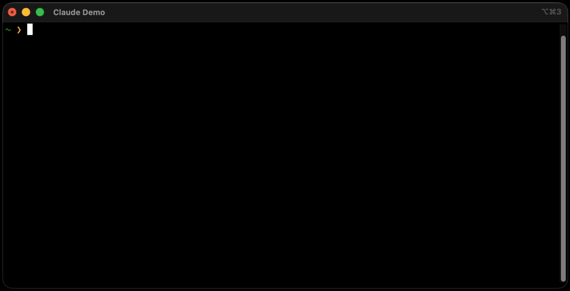

<p align="center">
  
</p>

<h1 align="center">Claude Onboarding Agent</h1>

<p align="center">
  <strong>Claude is powerful. But only if set up right.</strong><br>
  From blank project to a Claude Code setup tailored to <em>your</em> work — in under five minutes.
</p>

<p align="center">
  
</p>

---

Most people start a new Claude session and just... start typing. No context, no workflow, no structure. Results are inconsistent, Claude forgets everything between sessions, and it never really learns how you work.

This plugin fixes that. Run `/onboarding` once — Claude scans your project, asks a handful of targeted questions, and generates everything you need: a tailored `CLAUDE.md`, subagent roles, tool permissions, workflow instructions, and more.

Already know what you need? Call any setup skill directly.

---

## Pick your path

Not sure where to start? Run `/onboarding` and we'll figure it out with you. Or jump in:

| You are… | Run this | You get |
|---|---|---|
| **A developer** shipping code | `/coding-setup` | Superpowers workflow, subagent roles, stack permissions |
| **Building a web app** (frontend, backend, or full-stack) | `/web-development-setup` | Frontend, backend, or full-stack web app — framework-aware permissions, env-var hygiene, deploy-target pointers |
| **A data scientist / ML engineer** | `/data-science-setup` | Notebook hygiene, experiment tracking, `data/raw→processed` layout, reproducibility |
| **Building a personal wiki / second brain** | `/knowledge-base-setup` | Karpathy-pattern wiki, optional Obsidian CLI subagent |
| **Writing docs, emails, reports** | `/office-setup` | Writing style, document templates, company context |
| **A researcher or academic** | `/research-setup` | Citation format, domain vocabulary, LaTeX-aware ignores |
| **Writing a thesis, paper, or dissertation** | `/academic-writing-setup` | Thesis / paper / dissertation — LaTeX or Typst, Zotero, citation rules that prevent hallucinations |
| **Creating content** (YouTube, blog, social) | `/content-creator-setup` | Brand voice, platform presets, audience profile |
| **Running infra / DevOps** | `/devops-setup` | Cloud + IaC + CI config, safe-by-default infra workflow |
| **Designing UIs** | `/design-setup` | Design tool + frontend stack, UI guidelines, no generic AI looks |
| **Already set up, but Claude burns tokens searching large repos / docs / PDFs** | `/graphify-setup` | Local [Graphify](https://github.com/safishamsi/graphify) knowledge-graph index + `/graphify` slash command + PreToolUse hook (consulted before Grep/Glob/Read) — layers on top of any other setup |

---

## Install

### Option 1 — Plugin marketplace (recommended, soon)

```
/plugin install claude-onboarding-agent
```

> Marketplace listing is in progress. Use Option 2 in the meantime.

### Option 2 — One-liner (works today)

```bash
curl -fsSL https://raw.githubusercontent.com/a2ngerer/claude_onboarding_agent/main/scripts/install.sh | bash
```

Clones the repo and symlinks all skills into `~/.claude/skills/` so Claude Code picks them up automatically. To update: re-run the same command.

> How it works under the hood, plus what the future plugin path looks like: [docs/installation.md](docs/installation.md)

### Uninstall

```bash
curl -fsSL https://raw.githubusercontent.com/a2ngerer/claude_onboarding_agent/main/scripts/uninstall.sh | bash
```

---

## What's inside

| Command | What it does |
|---|---|
| `/onboarding` | Orchestrator — scans your repo, infers your use case, routes you to the right setup |
| `/coding-setup` | Installs [Superpowers](https://github.com/obra/superpowers), wires up brainstorm → plan → subagents → review → commit |
| `/web-development-setup` | Framework-aware web-app setup — Next.js / React / Vue / Svelte / SolidJS / Astro / Remix + optional backend (Node/Bun/Python/Go). API conventions, component structure, env-var hygiene, deploy-target pointers |
| `/data-science-setup` | Notebook workflow (Jupyter/marimo), experiment tracking (MLflow/W&B/DVC), reproducible `pyproject.toml`, `data/raw/interim/processed` layout, model-card pointers |
| `/knowledge-base-setup` | Builds a [Karpathy-pattern](https://github.com/forrestchang/andrej-karpathy-skills) wiki from your notes or codebase (+ optional [Obsidian](https://obsidian.md) CLI integration via dispatched subagent — no always-on MCP token cost) |
| `/office-setup` | Writing style, document preferences, company context |
| `/research-setup` | Citation format, research domain, academic writing guidelines |
| `/academic-writing-setup` | Thesis / paper / dissertation setup — LaTeX or Typst stack, Zotero + Better BibTeX, citation style, no-invented-citations rules, `sections/`/`bib/`/`figures/` scaffold |
| `/content-creator-setup` | Brand voice, platform preferences, audience context |
| `/devops-setup` | Cloud provider, IaC tool, CI/CD — safe infra workflow + agent roles |
| `/design-setup` | Design tool, frontend stack, accessibility standard — UI guidelines without the generic AI look |
| `/graphify-setup` | Installs [Graphify](https://github.com/safishamsi/graphify) (25-language tree-sitter + Markdown + PDF + media indexer). Registers `/graphify query / path / explain` and a PreToolUse hook consulted before file-search tool calls — cuts token cost on large codebases and mixed-media corpora. Safe to layer on top of any other setup |
| `/audit-setup` | Audits your existing Claude setup — permissions, CLAUDE.md quality, git hygiene, tooling — and returns a prioritized improvement list |
| `/upgrade-setup` | Re-applies current best practices to an existing setup. Per-change diff preview, dry-run flag, timestamped backups, never touches content outside the plugin's delimited sections |
| `/checkup` | Decides whether your existing setup should be rebuilt or selectively improved — then delegates. Pure router: runs `/audit-setup`, weighs findings + meta age + deprecated-model anchors, and hands off to `/onboarding --rebuild`, `/upgrade-setup`, or a short "fine-as-is" summary |
| `/anchors` | Refresh anchor-derived marker sections in CLAUDE.md/AGENTS.md against the latest upstream anchors. |

---

## How it works

```
/onboarding
     │
     ▼
Scan repo — detect files, manifests, existing CLAUDE.md
     │
     ▼
Suggest the most likely use case (or ask if the repo is empty)
     │
     ├── 1. Coding Setup
     ├── 2. Data Science / ML
     ├── 3. Knowledge Base Builder
     ├── 4. Office & Business
     ├── 5. Research & Writing
     ├── 6. Content Creation
     ├── 7. DevOps & Infrastructure
     └── 8. Design & Frontend
               │
               ▼
     Ask 3–7 targeted questions
               │
               ▼
     Install Superpowers (always for Coding/KB, optional for others)
               │
               ▼
     Generate CLAUDE.md + config files
               │
               ▼
     Print a completion summary
```

---

## What gets generated

Every setup skill creates a tailored `CLAUDE.md` with context and instructions specific to your workflow. Here's what each path produces:

| Skill | CLAUDE.md | Agents | settings.json | .gitignore | Hooks | External |
|-------|-----------|--------|---------------|------------|-------|----------|
| Coding | ✓ + workflow | ✓ 3 roles (AGENTS.md) | ✓ stack permissions | ✓ stack | — | Superpowers |
| Web Development | ✓ + pointers (`.claude/rules/api-conventions.md`, `component-structure.md`, `env-vars.md`) | — | ✓ framework + package-manager + deploy-CLI permissions | ✓ `node_modules/`, framework build outputs (`.next/`, `dist/`, `.astro/`, …), `.env.local`, test artifacts | ✓ type-check on save (TS only, opt-in) | Superpowers (optional) |
| Data Science | ✓ + pointers (`.claude/rules/data-schema.md`, `evaluation-protocol.md`) | — | ✓ uv / notebook / tracker permissions | ✓ raw data, notebook checkpoints, experiment artifacts | ✓ nbstripout on save (opt-in) | Superpowers (optional) |
| Knowledge Base | ✓ + Karpathy pattern | ✓ `.claude/agents/obsidian-vault-keeper.md` (optional) | — | ✓ | — | Superpowers + Karpathy |
| Office | ✓ + writing style | — | — | ✓ | — | Superpowers (optional) |
| Research | ✓ + citation format | — | — | ✓ LaTeX | — | Superpowers (optional) |
| Academic Writing | ✓ + non-negotiable citation rules (pointers to `.claude/rules/writing-style.md`, `citation-rules.md`) | — | — | ✓ LaTeX / Typst build artifacts | ✓ SessionStart rules reload (opt-in) | Superpowers (optional) |
| Content | ✓ + brand voice | — | — | ✓ media files | — | Superpowers (optional) |
| DevOps | ✓ + infra workflow | ✓ 3 roles | ✓ stack permissions | ✓ IaC state, secrets | ✓ plan-before-apply guard (opt-in) | Superpowers (optional) |
| Design | ✓ + UI guidelines | ✓ 2 roles | ✓ stack permissions | ✓ design assets | — | Superpowers (optional) |
| Graphify | ✓ + delimited pointer block (`/graphify query / path / explain`) | — | Graphify registers its own PreToolUse hook via `graphify install` | — | (Graphify's own PreToolUse hook) | `graphifyy` (Python package via `uv tool install`, `pipx` fallback) |

### The coding workflow (powered by Superpowers)

The Coding Setup installs [Superpowers](https://github.com/obra/superpowers) — a battle-tested Claude Code workflow library with 94,000+ users — and wires it into your `CLAUDE.md`. Every future session follows a proven loop:

```
Brainstorm idea → Write plan → Dispatch subagents → Code review → Commit
```

### The knowledge base (Karpathy pattern)

The Knowledge Base Builder sets up the [Karpathy LLM Wiki pattern](https://github.com/forrestchang/andrej-karpathy-skills): a `raw/` folder for source material and a `wiki/` folder of interlinked markdown notes that Claude builds and maintains. Drop files into `raw/`, ask Claude to ingest them — the wiki grows automatically.

Optional: connect [Obsidian](https://obsidian.md) via the official Obsidian CLI, wired into a dedicated `obsidian-vault-keeper` subagent. Vault reads/writes only load the CLI reference when actually invoked, so chats that don't touch the vault pay zero Obsidian tokens — unlike a persistent MCP whose tool schemas are loaded into every session.

---

## Realtime anchors

Some best practices change faster than plugin releases — current Claude model IDs, recommended Python tooling, the MCP server landscape. To keep skills accurate without requiring users to reinstall the plugin, this repo ships a set of short, auto-updated reference snapshots under [`docs/anchors/`](docs/anchors/).

Skills fetch anchors at runtime from a pinned `raw.githubusercontent.com` URL via the shared [`skills/_shared/fetch-anchor.md`](skills/_shared/fetch-anchor.md) protocol (24h cache, embedded offline fallback). A daily GitHub Action researches the sources listed in each anchor and opens a PR for human review — anchors are never auto-merged. Format details: [`docs/anchors/README.md`](docs/anchors/README.md).

---

## Language support

All skills detect your language automatically from your first message and respond accordingly. Supported: English, German, Spanish, French, and any other language Claude Code supports.

---

## Contributing

See [CONTRIBUTING.md](CONTRIBUTING.md) for how to add new setup skills.

---

## Authors

- Alexander Angerer — <alexander.angerer@outlook.de>
- Maximilian Achenbach — <Maximiliana28@gmail.com>

---

## License

[MIT](LICENSE) — free to use, modify, and distribute.
